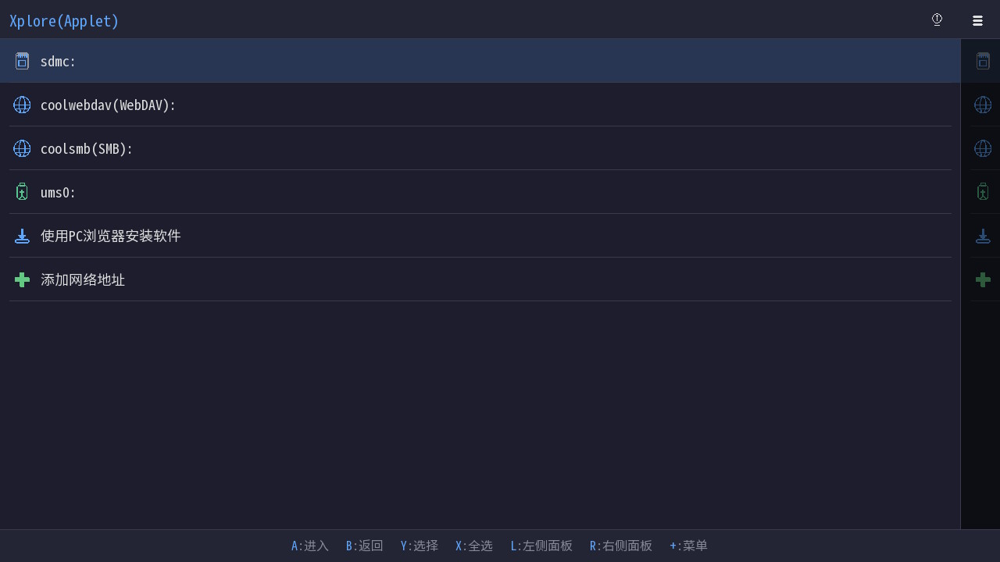
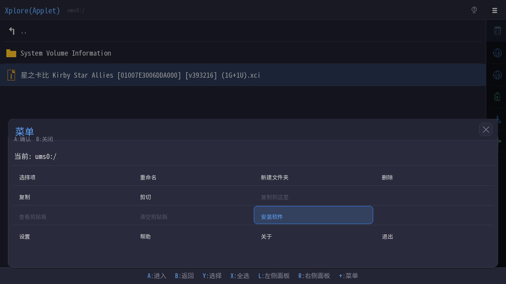
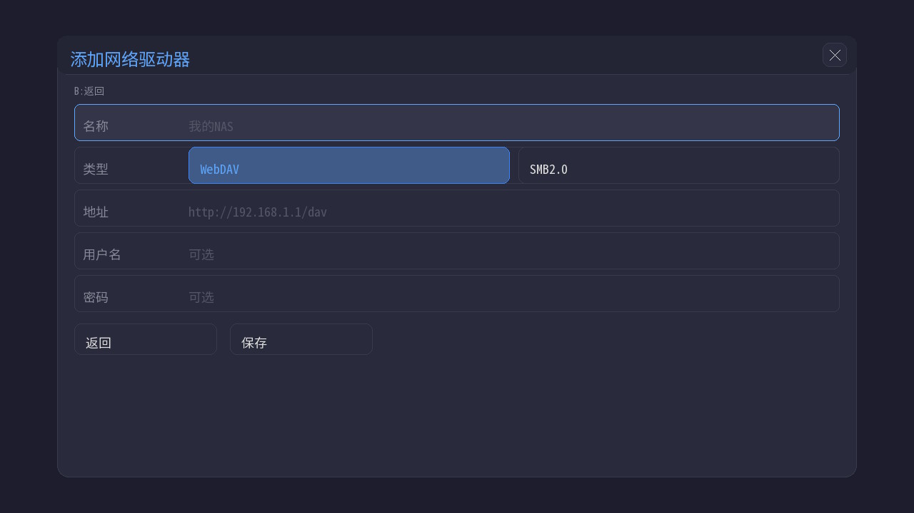
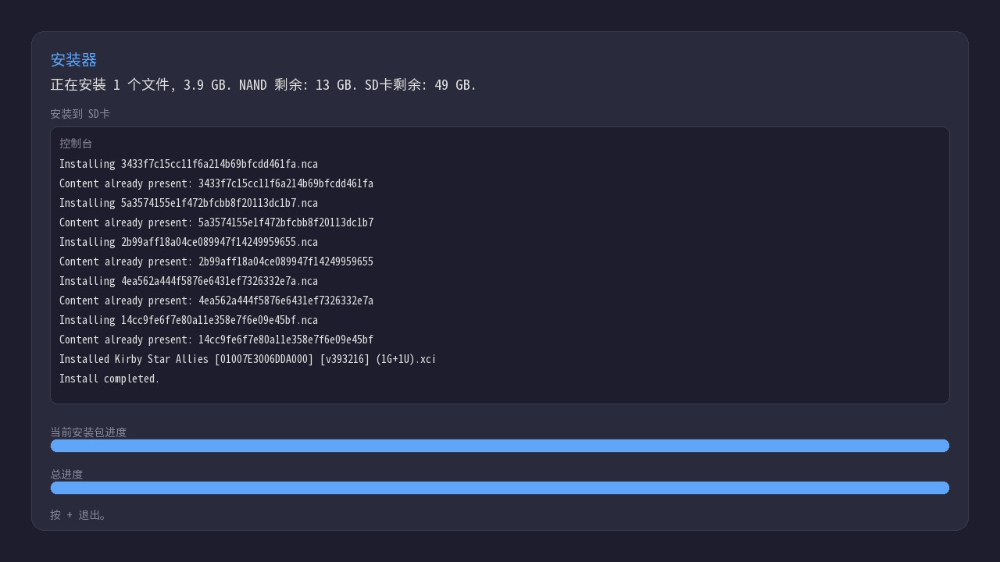

# Xplore

Nintendo Switch 上专业的文件管理器, 软件安装器。

[English](README.md) | 中文

## 特性

- 可以随意浏览和管理 SD卡 / WebDav / Samba / USB设备中的文件, 也可以安装器中的 NSP / XCI / NSZ / XCZ。
- 高效的文件管理, 双页签模式, 提高在不同驱动器之间复制或移动文件的效率。
- 支持触摸屏操作。
- 安装器缓冲, 非线性读写, 即便是网络文件一样快速。
- 启动HTTP服务器, PC只需要浏览器, 不需要安装额外软件, 就可以向Switch安装软件。
- 外挂字体, 显示非SD卡以外驱动器的CJK文件名。

## 截图

界面:



菜单:



网络驱动器:



安装:


## 构建

### 环境要求

- [devkitPro](https://devkitpro.org/)（devkitA64 + libnx + switch portlibs）
- Python 3
- [uv](https://github.com/astral-sh/uv)

### 步骤

```bash
# 1. 准备字体：将 CJK 全字符字体放入 scripts/cjk.ttf

# 2. 安装 Python 依赖（首次）
uv pip install fonttools brotli

# 3. 生成子集化字体 -> romfs/fonts/xplore.ttf
uv run python scripts/subset_font.py

# 4. 编译
make DEFINES=-DXPLORE_DEBUG

# 5. 或生成分发目录
make DEFINES=-DXPLORE_DEBUG dist
```

生成的 `xplore.nro` 可通过 hbmenu 运行。

`make dist` 会创建 `dist/switch/`，并把 `xplore.nro` 复制进去，同时把 `scripts/cjk.ttf` 改名为 `xplore.ttf` 一并放入，供外挂字体加载使用。

## 外挂字体

Xplore 会检查运行中的 `.nro` 同目录、同文件名的 `.ttf`。

例如：

```text
sdmc:/switch/xplore/xplore.nro
sdmc:/switch/xplore/xplore.ttf
```

如果 `xplore.ttf` 存在，Xplore 会把它作为整个 UI 的唯一字体使用，不和内置字体混排；如果不存在，则使用 `romfs:/fonts/xplore.ttf`。

这适合在内置子集字体缺字时补充更多字符。

### SMB2 支持

SMB2 网络驱动器支持需要 [libsmb2](https://github.com/sahlberg/libsmb2)，Xplore 会直接链接它。

```bash
# 克隆 libsmb2
git clone https://github.com/sahlberg/libsmb2.git
cd libsmb2

# 为 Switch 编译并安装
sudo make -f Makefile.platform switch_install
```

安装后重新编译 Xplore 即可。


### DEBUG MODE
```shell
make DEFINES=-DXPLORE_DEBUG
```

## 协议

参考 [LICENSE](LICENSE) 文件。

除上述声明的依赖 作者使用 [cjk-fonts-ttf](https://github.com/life888888/cjk-fonts-ttf) 字体。

