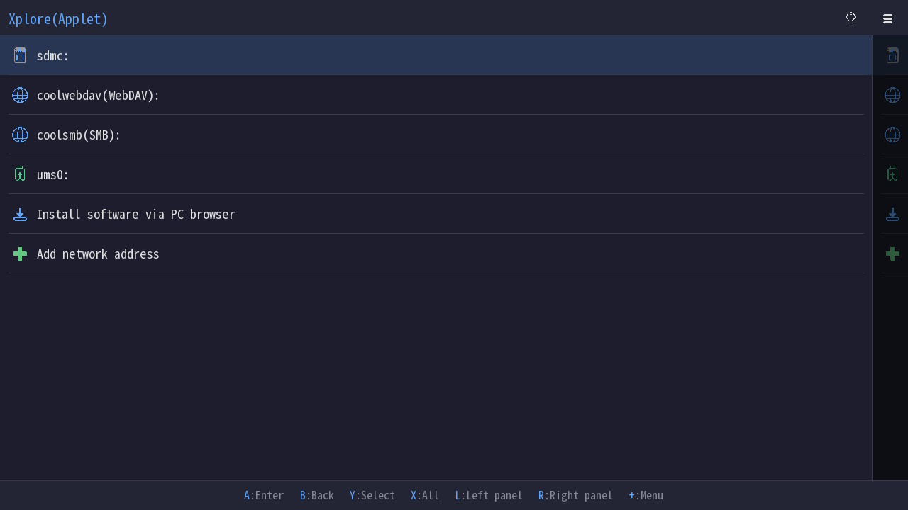
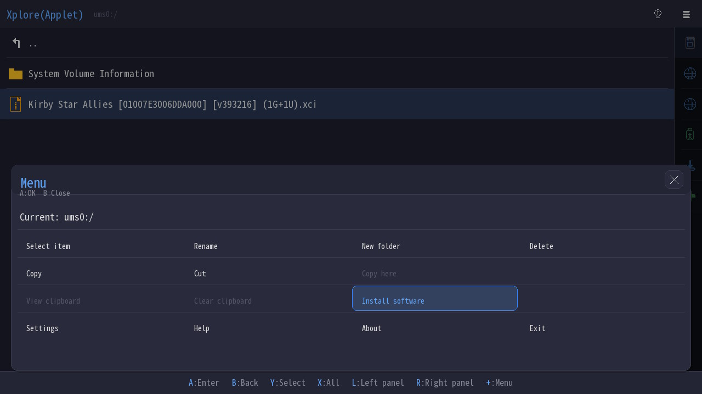
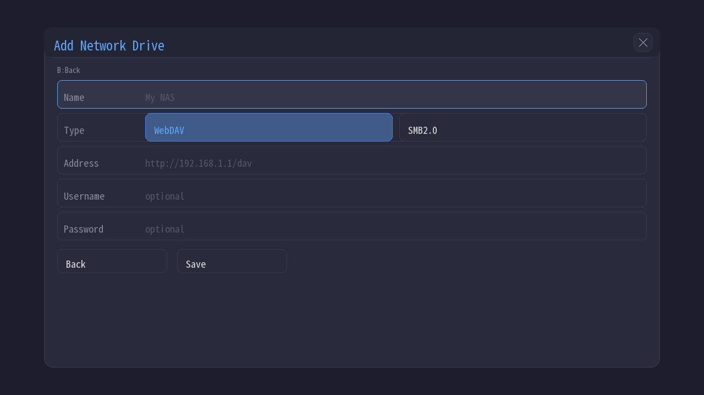
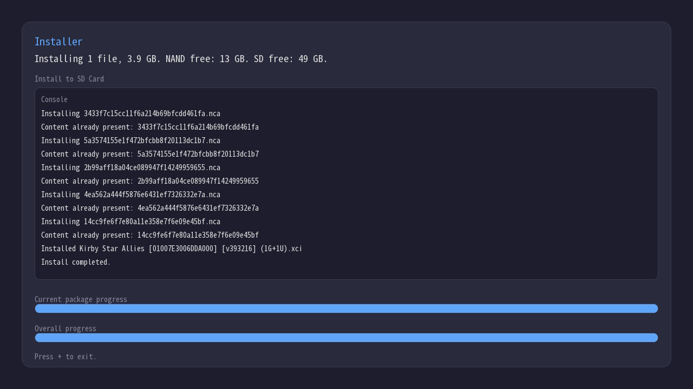

# Xxplore

A professional file manager and software installer for Nintendo Switch.

English | [中文](README-zh.md)

## Features

- Freely browse and manage files on SD card / WebDav / Samba / USB devices / FTP server, and install NSP / XCI / NSZ / XCZ packages.
- Open ZIP archives as virtual folders, browse their contents, test them, and extract them to the current folder, an archive-named folder, or the other pane.
- Pack the current file / folder or the current multi-selection into a ZIP archive in the current pane or the other pane.
- Efficient file management with dual-pane mode for faster copy and move operations between different drives.
- Touchscreen support.
- Built-in HTTP server so a PC browser can install software to the Switch without any extra desktop software.
- External font support for displaying CJK filenames from drives other than the SD card.
- The dual-threaded, buffered streaming mode enables faster file copying speeds.

## Screenshots

Interface:



Menu:



Network drive:



Install:


## Build

### Requirements

- [devkitPro](https://devkitpro.org/) (devkitA64 + libnx + switch portlibs)
- Python 3
- [uv](https://github.com/astral-sh/uv)

### Native dependencies

#### minizip (ZIP browse / extract / pack)

Xxplore uses `minizip` for ZIP browsing, extraction and packing.

Under devkitPro for Switch, `minizip` is provided by the `switch-zlib` package. It installs:

- `portlibs/switch/include/minizip/*.h`
- `portlibs/switch/lib/libminizip.a`

Install it with devkitPro pacman before building Xxplore:

```bash
# Arch Linux / MSYS2 + devkitPro
pacman -S switch-zlib

# macOS / Linux without a system pacman
dkp-pacman -S switch-zlib
```

If your setup requires elevated privileges for the devkitPro prefix, prepend `sudo`.

#### libusbhsfs (USB Mass Storage)

Xxplore uses [libusbhsfs](https://github.com/DarkMatterCore/libusbhsfs) for USB mass storage mounting.

According to the upstream project, `libusbhsfs` supports two build modes:

- `BUILD_TYPE=ISC`: FAT-only support.
- `BUILD_TYPE=GPL`: FAT + NTFS-3G + lwext4 support, under GPLv2 or later.

Xxplore's current `Makefile` links `-lusbhsfs -lntfs-3g -llwext4`, so the expected setup is the **GPL build**.

Install the required filesystem portlibs first, then build and install `libusbhsfs`:

```bash
# Arch Linux / MSYS2 + devkitPro
pacman -S switch-ntfs-3g switch-lwext4

# macOS / Linux without a system pacman
dkp-pacman -S switch-ntfs-3g switch-lwext4

git clone https://github.com/DarkMatterCore/libusbhsfs.git
cd libusbhsfs
make BUILD_TYPE=GPL install
```

If you want the upstream debug build with logging, install that variant instead and adjust the link flags accordingly.

### Steps

```bash
# 1. Prepare the font: put a full CJK font at scripts/cjk.ttf

# 2. Install Python dependencies (first time only)
uv pip install fonttools brotli

# 3. Generate the subset font -> romfs/fonts/xxplore.ttf
uv run python scripts/subset_font.py

# 4. Build
make DEFINES=-DXXPLORE_DEBUG

# 5. Or build a distributable folder
make DEFINES=-DXXPLORE_DEBUG dist
```

The generated `xxplore.nro` can then be launched from hbmenu.

`make dist` creates `dist/switch/`, copies `xxplore.nro` into it, and also copies `scripts/cjk.ttf` renamed as `xxplore.ttf` for external font loading.

## External Font

Xxplore checks for an external `.ttf` next to the running `.nro`.

Example:

```text
sdmc:/switch/xxplore/xxplore.nro
sdmc:/switch/xxplore/xxplore.ttf
```

If `xxplore.ttf` exists, Xxplore uses that font for all UI text. There is no fallback mixing with the built-in font. If it does not exist, Xxplore uses `romfs:/fonts/xxplore.ttf`.

This is useful when the built-in subset font is missing characters you need.

### SMB2 Support

SMB2 network drive support requires [libsmb2](https://github.com/sahlberg/libsmb2). Xxplore links against it directly.

```bash
# Clone libsmb2
git clone https://github.com/sahlberg/libsmb2.git
cd libsmb2

# Build and install for Switch
sudo make -f Makefile.platform switch_install
```

After installation, rebuild Xxplore.

### Debug Mode

```bash
make DEFINES=-DXXPLORE_DEBUG
```

## License

See [LICENSE](LICENSE).

In addition to the dependencies listed above, the author uses the font from [cjk-fonts-ttf](https://github.com/life888888/cjk-fonts-ttf).
